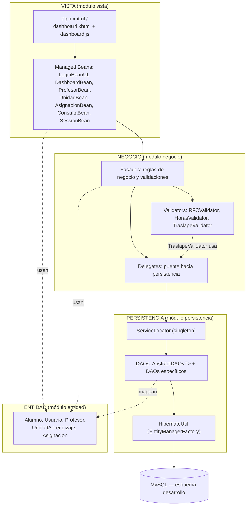
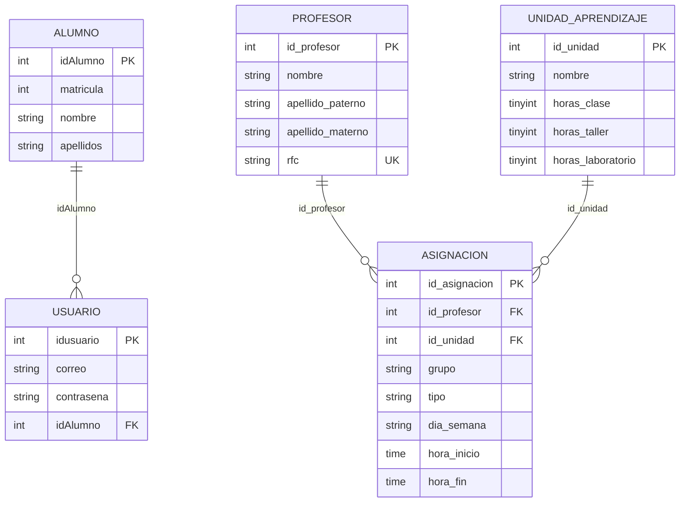
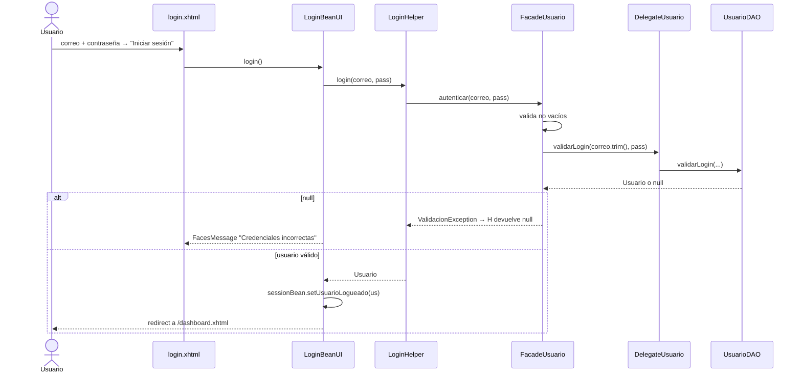
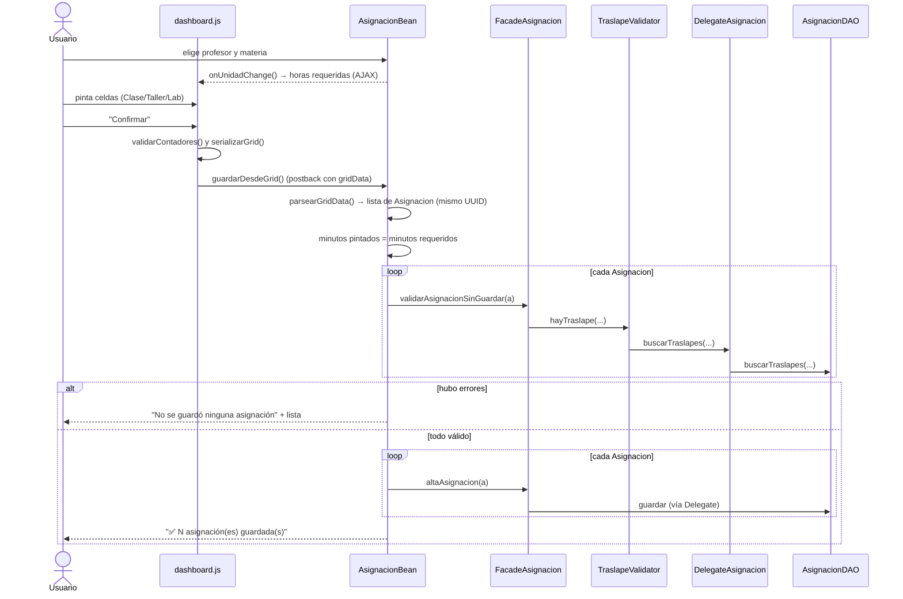

# Manual Técnico — SAUAP

**Sistema de Asignación de Unidades de Aprendizaje a los Profesores**
Materia: Desarrollo de Software · UABC · Período 2026-2

> **Alcance de este documento.** Está basado en la rama `integracion` del repositorio
> `Anza3004/SAUAP_2026-2`, commit `d5e9361` (20/09/2026). Se elaboró leyendo el código
> fuente; no se compiló ni se ejecutó la aplicación. Complementa (y en algunos puntos
> actualiza) `docs/ARQUITECTURA_CAPAS.md`, que explica la teoría y las referencias;
> este manual documenta **el código real**: clases, variables, métodos y cómo se llaman entre sí.

---

## Índice

1. [Visión general y tecnologías](#1-visión-general-y-tecnologías)
2. [Estructura del proyecto](#2-estructura-del-proyecto)
3. [Arquitectura por capas](#3-arquitectura-por-capas)
4. [Modelo de datos](#4-modelo-de-datos)
5. [Capa de Entidad](#5-capa-de-entidad)
6. [Capa de Persistencia](#6-capa-de-persistencia)
7. [Capa de Negocio](#7-capa-de-negocio)
8. [Capa de Vista](#8-capa-de-vista)
9. [Mapa de llamadas: de la pantalla a la base de datos](#9-mapa-de-llamadas-de-la-pantalla-a-la-base-de-datos)
10. [Flujos detallados](#10-flujos-detallados)
11. [Reglas de negocio y dónde se aplican](#11-reglas-de-negocio-y-dónde-se-aplican)
12. [Configuración, compilación y despliegue](#12-configuración-compilación-y-despliegue)
13. [Pruebas existentes](#13-pruebas-existentes)
14. [Hallazgos y deuda técnica](#14-hallazgos-y-deuda-técnica)

---

## 1. Visión general y tecnologías

SAUAP es una aplicación web que permite dar de alta profesores y unidades de aprendizaje
(materias), asignar materias a profesores en un horario semanal (lunes a viernes, 07:00–21:00)
sin traslapes, y consultar, modificar o eliminar esas asignaciones.

| Tecnología | Versión (según los `pom.xml`) | Uso |
|---|---|---|
| Java | 21 | Lenguaje |
| Maven | multimódulo (`packaging pom` en la raíz) | Construcción |
| Hibernate ORM | 6.6.11.Final | ORM / implementación de JPA |
| Jakarta Persistence | 3.1.0 | API JPA |
| HikariCP | 5.0.1 | Pool de conexiones |
| MySQL Connector/J | 9.2.0 | Driver JDBC |
| Jakarta Faces (Mojarra) | 4.0.1 | Framework web (JSF) |
| PrimeFaces / Extensions | 14.0.0 (classifier `jakarta`) | Declarado como dependencia (ver hallazgo 1) |
| Weld Servlet (shaded) | 5.1.1.Final | CDI (`@Named`, `@Inject`, scopes) |
| Servidor | Tomcat 11 (según la documentación de arquitectura) | Contenedor web |
| Base de datos | MySQL, esquema `desarrollo` | Persistencia |

---

## 2. Estructura del proyecto

```
SAUAP_2026-2/
├── pom.xml                       ← POM padre (módulos: entidad, persistencia, negocio, vista)
├── docs/ARQUITECTURA_CAPAS.md
├── entidad/                      ← Capa de Entidad (JPA)
│   └── src/main/java/mx/desarrollo/entity/
│       Alumno, Usuario, Profesor, UnidadAprendizaje, Asignacion
├── persistencia/                 ← Capa de Persistencia (DAOs)
│   └── src/main/java/mx/desarrollo/persistencia/
│       ├── persistence/   AbstractDAO, HibernateUtil
│       ├── dao/           AlumnoDAO, UsuarioDAO, ProfesorDAO, UnidadAprendizajeDAO, AsignacionDAO
│       └── integration/   ServiceLocator
│   └── src/main/resources/META-INF/persistence.xml   (unidad "persistencia_PU")
├── negocio/                      ← Capa de Negocio
│   └── src/main/java/mx/desarrollo/negocio/
│       ├── facade/        FacadeAlumno, FacadeUsuario, FacadeProfesor, FacadeUnidad, FacadeAsignacion
│       ├── delegate/      DelegateAlumno, DelegateUsuario, DelegateProfesor, DelegateUnidad, DelegateAsignacion
│       └── integration/   RFCValidator, HorasValidator, TraslapeValidator, ValidacionException
└── vista/                        ← Capa de Presentación (WAR)
    ├── src/main/java/mx/desarrollo/
    │   ├── ui/            LoginBeanUI, SessionBean, DashboardBean, ProfesorBean,
    │   │                  UnidadBean, AsignacionBean, ConsultaBean, DummyBean
    │   └── helper/        LoginHelper
    └── src/main/webapp/
        ├── login.xhtml, dashboard.xhtml, index.xhtml, index.jsp
        ├── WEB-INF/       web.xml, faces-config.xml, beans.xml, lib/all-themes-1.0.10.jar
        └── resources/     css/styles.css, css/style.css, js/dashboard.js, images/*
```

**Dependencias entre módulos Maven**

```
vista ──▶ negocio ──▶ persistencia ──▶ entidad
  │                                      ▲
  └──────────────────────────────────────┘   (la vista también usa las entidades directamente)
```

---

## 3. Arquitectura por capas



### 3.1 Responsabilidad de cada capa

| Capa | Módulo | Responsabilidad | Habla con |
|---|---|---|---|
| **Vista** | `vista` | Pantallas, captura de datos, mensajes al usuario, estado de la interfaz | Solo con Facades (y entidades como contenedor de datos) |
| **Negocio** | `negocio` | Reglas de negocio y validaciones. Decide si una operación se permite | Delegates → capa de persistencia |
| **Persistencia** | `persistencia` | Acceso a datos con JPA/Hibernate: consultas, inserciones, borrados | Base de datos |
| **Entidad** | `entidad` | Clases del dominio mapeadas a tablas. Es **transversal**: todas las capas las usan | — |

> **Nota:** la entidad no es una capa "por debajo" en sentido estricto: la Vista, el Negocio y
> la Persistencia comparten los mismos objetos (`Profesor`, `Asignacion`, etc.) como contenedor de datos.
> No hay DTOs separados.

### 3.2 Patrones aplicados y dónde están

| Patrón | Clase(s) | Qué resuelve |
|---|---|---|
| **DAO** | `ProfesorDAO`, `AsignacionDAO`, … | Aísla el SQL/JPQL de las reglas de negocio |
| **Template / DAO genérico** | `AbstractDAO<T>` | CRUD escrito una sola vez para todas las entidades |
| **Singleton** | `HibernateUtil` (EMF estático), `ServiceLocator` (`getInstance()` sincronizado) | Una sola fábrica de `EntityManager` y un solo juego de DAOs |
| **Service Locator** | `ServiceLocator` | Los Delegates obtienen los DAOs de un punto central |
| **Business Delegate** | `DelegateProfesor`, … | Desacopla las Facades de los DAOs (pasarela 1 a 1) |
| **Facade** | `FacadeProfesor`, … | Punto de entrada único de la Vista al negocio; aquí viven las validaciones |
| **MVC (JSF)** | XHTML (vista) + Beans (controlador) + Entidades (modelo) | Separa pantalla de lógica de pantalla |
| **Excepción de dominio** | `ValidacionException` | Comunica errores de regla de negocio hacia la Vista |

### 3.3 Regla de comunicación

```
Bean (vista)  →  Facade  →  Delegate  →  ServiceLocator  →  DAO  →  EntityManager  →  MySQL
                    │
                    └→ Validator (RFC, horas, traslape)
```

* Un **bean** nunca llama a un DAO ni a un Delegate; solo a Facades.
* Una **Facade** nunca ejecuta consultas; valida y delega.
* Un **Delegate** no valida nada; solo traduce la llamada a un DAO.
* Un **DAO** no conoce reglas de negocio; solo lee y escribe.
* Las excepciones de regla (`ValidacionException`) suben desde la Facade hasta el bean, que las convierte en mensaje para el usuario.

---

## 4. Modelo de datos



`Asignacion` es la tabla intermedia de la relación muchos-a-muchos entre `Profesor` y
`UnidadAprendizaje`. Cada **fila** es un bloque horario (día + hora inicio + hora fin + tipo).
Una asignación "completa" de una materia a un profesor son **varias filas que comparten el mismo `grupo`**.

| Columna de `asignacion` | Significado |
|---|---|
| `grupo` | UUID (36 caracteres) que agrupa todos los bloques (clase, taller y laboratorio) de una misma asignación. **No** es el número de grupo escolar |
| `tipo` | `CLASE`, `TALLER` o `LABORATORIO`. Es `NULL` en registros anteriores a la existencia del campo |
| `dia_semana` | `LUNES`, `MARTES`, `MIERCOLES`, `JUEVES`, `VIERNES` (texto, sin acentos) |
| `hora_inicio` / `hora_fin` | `TIME`. Un bloque de varias horas consecutivas del mismo tipo se guarda como **una** fila |

> El repositorio **no incluye** el script SQL del esquema. Como `persistence.xml` usa
> `hibernate.hbm2ddl.auto=validate`, la aplicación **no crea tablas**: si el esquema no coincide
> con las entidades, falla al arrancar. Conviene agregar el script (por ejemplo en `docs/` o `db/`).

---

## 5. Capa de Entidad

Paquete `mx.desarrollo.entity`. Todas usan `@GeneratedValue(strategy = IDENTITY)` para el id.
Los getters/setters son los estándar; se listan solo los atributos.

| Clase | Tabla | Atributos (Java → columna) | Restricciones en anotaciones |
|---|---|---|---|
| `Alumno` | `alumno` | `Integer id` → `idAlumno`; `Integer matricula`; `String nombre` (45); `String apellidos` (45) | `@NotNull`, `@Size(max=45)` |
| `Usuario` | `usuario` | `Integer id` → `idusuario`; `String correo` (45); `String contrasena` (45); `Alumno idAlumno` (`@ManyToOne` LAZY) | `@NotNull`, `@Size(max=45)` |
| `Profesor` | `profesor` | `Integer id` → `id_profesor`; `String nombre` (50); `String apellidoPaterno` (50); `String apellidoMaterno` (50); `String rfc` (13, `unique`) | `@NotNull`, `@Size` |
| `UnidadAprendizaje` | `unidad_aprendizaje` | `Integer id` → `id_unidad`; `String nombre` (50); `Byte horasClase`; `Byte horasTaller`; `Byte horasLaboratorio` | `@NotNull` |
| `Asignacion` | `asignacion` | `Integer id` → `id_asignacion`; `Profesor profesor` (`@ManyToOne` LAZY); `UnidadAprendizaje unidad` (`@ManyToOne` LAZY); `String grupo` (36); `String tipo` (15); `String diaSemana` (15); `LocalTime horaInicio`; `LocalTime horaFin` | `@NotNull` en profesor, unidad, día y horas |

Observaciones:

* `Usuario` reutiliza la tabla `alumno` del proyecto de práctica anterior: cada usuario del sistema está ligado a un alumno.
* `Profesor`, `Alumno`, `Usuario` y `Asignacion` implementan `Serializable` (necesario para beans de sesión/vista); `UnidadAprendizaje` **no**.
* `Asignacion.profesor` y `Asignacion.unidad` son `LAZY`. La Vista los lee después de que el `EntityManager` ya se cerró; esto funciona gracias a `hibernate.enable_lazy_load_no_trans=true` (ver sección 6.4).

---

## 6. Capa de Persistencia

Paquete raíz `mx.desarrollo.persistencia`.

### 6.1 `HibernateUtil` (`persistence`)

| Elemento | Descripción |
|---|---|
| `PERSISTENCE_UNIT = "persistencia_PU"` | Nombre de la unidad de persistencia (definida en `persistencia/.../persistence.xml`) |
| `static final EntityManagerFactory emf` | Se crea **una sola vez** en el bloque `static`. Si falla, lanza `ExceptionInInitializerError` |
| `getEntityManagerFactory()` | Devuelve la fábrica |
| `shutdown()` | Cierra la fábrica (no se invoca desde ningún lugar de la vista) |

### 6.2 `AbstractDAO<T>` (`persistence`)

CRUD genérico. **Cada método abre su propio `EntityManager` y lo cierra en `finally`**; las escrituras corren en su propia transacción (`RESOURCE_LOCAL`).

| Método | Qué hace |
|---|---|
| `AbstractDAO(Class<T>)` | Guarda la clase de la entidad (`entityClass`) |
| `protected EntityManager getEntityManager()` | Crea un `EntityManager` nuevo desde `HibernateUtil` |
| `T guardar(T entity)` | `merge` dentro de transacción; sirve para **insertar** (id nulo) y **actualizar**. Devuelve la copia administrada (ya con `id`). Hace rollback si hay error |
| `void eliminar(T entity)` | Si la entidad no está en el contexto, la `merge`a; luego `remove`. Con transacción y rollback |
| `T buscarPorId(Object id)` | `em.find`; devuelve `null` si no existe |
| `List<T> listarTodos()` | JPQL `SELECT e FROM <NombreClase> e` |

### 6.3 DAOs específicos (`dao`)

Todos heredan de `AbstractDAO<Entidad>` y llaman a `super(Entidad.class)`.

**`ProfesorDAO`**

| Método | Retorno | Descripción |
|---|---|---|
| `buscarPorRFC(String rfc)` | `Profesor` o `null` | `WHERE p.rfc = :rfc` (captura `NoResultException`) |
| `listarOrdenados()` | `List<Profesor>` | Orden por `apellidoPaterno`, luego `apellidoMaterno` |

**`UsuarioDAO`**

| Método | Retorno | Descripción |
|---|---|---|
| `buscarPorCorreo(String correo)` | `Usuario` o `null` | Busca por correo |
| `validarLogin(String correo, String contrasena)` | `Usuario` o `null` | `WHERE correo = :correo AND contrasena = :pass` |

**`AlumnoDAO`** y **`UnidadAprendizajeDAO`**: solo el CRUD heredado.

**`AsignacionDAO`**

| Método | Retorno | Descripción |
|---|---|---|
| `buscarTraslapes(idProfesor, dia, horaInicio, horaFin)` | `List<Asignacion>` | Atajo: llama a la versión de 5 parámetros con `idExcluir = null` |
| `buscarTraslapes(idProfesor, dia, horaInicio, horaFin, idExcluir)` | `List<Asignacion>` | Filas del profesor, en ese día, con `a.horaInicio < :horaFin AND a.horaFin > :horaInicio`. Si `idExcluir != null` agrega `AND a.id <> :idExcluir` (para que al **modificar** una fila no choque consigo misma) |
| `listarPorProfesor(idProfesor)` | `List<Asignacion>` | Todas las filas de ese profesor |
| `listarPorUnidad(idUnidad)` | `List<Asignacion>` | Todas las filas de esa unidad |
| `listarNombresUnidadesPorProfesor(idProfesor)` | `List<String>` | Nombres de unidades (`DISTINCT`, ordenados) en las que está asignado el profesor. Se usa para **bloquear** el borrado del profesor |
| `listarNombresProfesoresPorUnidad(idUnidad)` | `List<String>` | `nombre + apellidoPaterno` (`DISTINCT`) de profesores con esa unidad. Bloquea el borrado de la unidad |
| `sumarMinutosAsignados(idUnidad)` | `Long` | Suma de minutos (`TIMESTAMPDIFF`) de las filas de la unidad. Solo informativo |
| `sumarMinutosAsignadosExcluyendo(idUnidad, idExcluir)` | `Long` | Igual, excluyendo una fila |
| `eliminarPorGrupo(String grupo)` | `int` | `DELETE ... WHERE a.grupo = :grupo`. Devuelve cuántas filas borró. Grupo nulo/vacío → `0` |
| `eliminarPorProfesorUnidadSinGrupo(idProfesor, idUnidad)` | `int` | Borra filas del par profesor-unidad con `grupo` nulo o vacío (registros antiguos) |

> **Detalle importante del traslape:** al comparar con `<` y `>` (intervalos semiabiertos), un bloque
> 08:00–09:00 **no** choca con otro 09:00–10:00.

### 6.4 `persistence.xml` (módulo `persistencia`)

| Propiedad | Valor | Efecto |
|---|---|---|
| Unidad | `persistencia_PU`, `RESOURCE_LOCAL` | La transacción la maneja el código (no un contenedor EJB) |
| `jdbc.url` | `jdbc:mysql://localhost:3306/desarrollo?useSSL=false&serverTimezone=UTC` | Conexión al esquema `desarrollo` |
| usuario / contraseña | `root` / `root` | Credenciales escritas en el archivo |
| `hibernate.hbm2ddl.auto` | `validate` | Verifica que el esquema coincida; no crea ni modifica tablas |
| `hibernate.show_sql` / `format_sql` | `true` | Imprime el SQL en consola |
| `hibernate.enable_lazy_load_no_trans` | `true` | Permite que la vista lea `a.profesor.nombre` o `a.unidad.nombre` (asociaciones LAZY) aunque el `EntityManager` ya esté cerrado |
| HikariCP | `minimumIdle=5`, `maximumPoolSize=10`, `idleTimeout=30000` | Pool de conexiones |

El módulo `entidad` tiene además su propio `persistence.xml` (unidad `entidad_PU`) que solo usa `TestConexion`.

### 6.5 `ServiceLocator` (`integration`)

Singleton (`getInstance()` es `synchronized`). En su constructor privado crea **un** DAO de cada tipo y los expone:

`getProfesorDAO()`, `getUnidadDAO()`, `getAsignacionDAO()`, `getAlumnoDAO()`, `getUsuarioDAO()`.

Los DAOs no guardan estado (cada operación crea su `EntityManager`), por eso compartir una sola instancia es seguro.

---

## 7. Capa de Negocio

Paquete raíz `mx.desarrollo.negocio`.

### 7.1 `ValidacionException` (`integration`)

`extends RuntimeException`. Constructores `(String mensaje)` y `(String mensaje, Throwable causa)`. Es el **canal de errores de regla de negocio**: la lanzan las Facades y la capturan los beans.

### 7.2 Validadores (`integration`)

**`RFCValidator`** (métodos estáticos)

| Método | Descripción |
|---|---|
| `esValido(String rfc)` | `false` si es nulo/vacío. Aplica la expresión regular `^[A-ZÑ&]{3,4}\d{6}[A-Z0-9]{3}$` sobre `rfc.toUpperCase().trim()` |
| `getMensajeError(String rfc)` | Mensaje de error o `null` si es válido |

**`HorasValidator`** (métodos estáticos; constantes `MIN_HORAS = 0`, `MAX_HORAS = 4`)

| Método | Descripción |
|---|---|
| `esValido(Byte horas)` | `true` si no es nulo y está entre 0 y 4 |
| `getMensajeError(String nombreCampo, Byte horas)` | Mensaje del tipo "Las horas clase deben estar entre 0 y 4." o `null` |

**`TraslapeValidator`** (tiene una instancia de `DelegateAsignacion`)

| Método | Descripción |
|---|---|
| `hayTraslape(idProfesor, dia, inicio, fin)` | Atajo con `idExcluir = null` (altas) |
| `hayTraslape(idProfesor, dia, inicio, fin, idExcluir)` | `false` si algún parámetro obligatorio es nulo; en otro caso pregunta al Delegate por traslapes y devuelve `!lista.isEmpty()` |
| `static rangoValido(inicio, fin)` | `inicio.isBefore(fin)` |
| `static getMensajeErrorRango(inicio, fin)` | Mensaje si faltan horas o el rango es inválido; `null` si está bien |

### 7.3 Delegates (`delegate`)

Cada Delegate obtiene `ServiceLocator.getInstance()` y **solo traduce la llamada al DAO**. No contiene reglas.

| Delegate | Métodos → DAO al que llegan |
|---|---|
| `DelegateProfesor` | `altaProfesor`, `modificarProfesor` → `ProfesorDAO.guardar`; `eliminarProfesor` → `eliminar`; `buscarPorId`; `buscarPorRFC`; `consultarProfesores` → `listarTodos`; `consultarProfesoresOrdenados` → `listarOrdenados`; `consultarUnidadesAsignadas(idProfesor)` → `AsignacionDAO.listarNombresUnidadesPorProfesor` |
| `DelegateUnidad` | `altaUnidad`, `modificarUnidad` → `guardar`; `eliminarUnidad`; `buscarPorId`; `consultarUnidades`; `consultarProfesoresAsignados(idUnidad)` → `AsignacionDAO.listarNombresProfesoresPorUnidad` |
| `DelegateAsignacion` | `altaAsignacion`, `modificarAsignacion` → `guardar`; `eliminarAsignacion`; `buscarPorId`; `consultarAsignaciones`; `buscarTraslapes` (2 sobrecargas); `buscarUnidad(idUnidad)` → `UnidadAprendizajeDAO.buscarPorId`; `consultarPorProfesor`; `consultarPorUnidad`; `sumarMinutosAsignados`; `sumarMinutosAsignadosExcluyendo`; `eliminarPorGrupo`; `eliminarPorProfesorUnidadSinGrupo` |
| `DelegateUsuario` | `buscarPorCorreo`; `validarLogin` |
| `DelegateAlumno` | `altaAlumno`; `buscarPorId`; `consultarAlumnos` |

### 7.4 Facades (`facade`)

Son la **puerta de entrada** de la Vista. Cada una crea su Delegate en el constructor (`new DelegateX()`).

**`FacadeProfesor`**

| Método | Reglas que aplica antes de delegar |
|---|---|
| `altaProfesor(Profesor)` | `validarProfesor` + RFC no duplicado (`delegate.buscarPorRFC`) |
| `modificarProfesor(Profesor)` | Requiere `id`; `validarProfesor`; el RFC no puede pertenecer a **otro** profesor |
| `eliminarProfesor(Profesor)` | Requiere `id`; si `consultarUnidadesAsignadas` no está vacía → `ValidacionException` con las materias que tiene; si está vacía, elimina |
| `buscarPorId`, `consultarProfesores`, `consultarProfesoresOrdenados` | Sin reglas |
| `validarProfesor` (privado) | Nombre y apellidos obligatorios y ≤ 50 caracteres; RFC según `RFCValidator` |

**`FacadeUnidad`**

| Método | Reglas |
|---|---|
| `altaUnidad(UnidadAprendizaje)` | `validarUnidad` |
| `modificarUnidad(UnidadAprendizaje)` | Requiere `id`; `validarUnidad` |
| `eliminarUnidad(UnidadAprendizaje)` | Requiere `id`; si tiene profesores asignados → `ValidacionException` con sus nombres |
| `buscarPorId`, `consultarUnidades` | Sin reglas |
| `validarUnidad` (privado) | Nombre obligatorio y ≤ 50; las tres horas con `HorasValidator` (0–4); **al menos una hora > 0** |

**`FacadeAsignacion`**

| Método | Descripción |
|---|---|
| `altaAsignacion(Asignacion)` | `validarAsignacion(a, null)` y luego `delegate.altaAsignacion` |
| `modificarAsignacion(Asignacion)` | Requiere `id`; `validarAsignacion(a, a.getId())` (excluye la propia fila del traslape) |
| `validarAsignacionSinGuardar(Asignacion)` | Solo valida, no guarda. Lo usa `AsignacionBean` para validar **todo el bloque antes de guardar cualquier fila** |
| `eliminarAsignacion(Asignacion)` | Borra la asignación **completa**: si tiene `grupo` → `eliminarPorGrupo`; si no (registro antiguo) → `eliminarPorProfesorUnidadSinGrupo`; si tampoco hay profesor/unidad → borra solo esa fila. Devuelve cuántas filas se eliminaron |
| `eliminarBloque(String grupo)` | Borra por grupo (exige grupo no vacío) |
| `buscarPorId`, `consultarAsignaciones`, `consultarPorProfesor`, `consultarPorUnidad` | Sin reglas |
| `minutosAsignados(idUnidad)`, `minutosRequeridos(idUnidad)` | Utilidades informativas (no las usa ningún bean actualmente) |
| `validarAsignacion(a, idExcluir)` (privado) | En orden: asignación no nula → profesor con id → unidad con id → día no vacío → horas no nulas → rango `inicio < fin` → **sin traslape** con otras filas del mismo profesor |
| `calcularHorasRequeridas(unidad)` (privado) | `horasClase + horasTaller + horasLaboratorio` (nulos cuentan 0) |

**`FacadeUsuario`**

| Método | Descripción |
|---|---|
| `autenticar(correo, contrasena)` | Correo y contraseña obligatorios; llama a `delegate.validarLogin(correo.trim(), contrasena)`; si devuelve `null` lanza `ValidacionException("Credenciales inválidas…")` |

**`FacadeAlumno`**: `altaAlumno` (matrícula, nombre y apellidos obligatorios), `buscarPorId`, `consultarAlumnos`. La interfaz no la usa.

---

## 8. Capa de Vista

### 8.1 Configuración web

| Archivo | Contenido relevante |
|---|---|
| `web.xml` | `FacesServlet` mapeado a `*.xhtml`; `PROJECT_STAGE=Development`; tema PrimeFaces `south-street`; sesión de **30 min**; página de bienvenida `login.xhtml` |
| `faces-config.xml` | Registra `PrimeResourceHandler` |
| `beans.xml` | `bean-discovery-mode="all"` (CDI descubre todas las clases) |
| `index.xhtml` | Redirección (`meta refresh`) a `login.xhtml` |
| `index.jsp` | Sobrante de la plantilla ("Hello World!") |

### 8.2 Managed Beans (`mx.desarrollo.ui`)

Todos usan `@Named` (CDI). Se indican el nombre EL, el *scope* y el estado que guardan.

#### `LoginBeanUI` — `#{loginUI}` · `@SessionScoped`

| Variable | Tipo | Uso |
|---|---|---|
| `loginHelper` | `LoginHelper` | Puente hacia la capa de negocio |
| `usuario` | `Usuario` | Enlazado a los campos correo/contraseña del formulario |
| `sessionBean` | `SessionBean` (`@Inject`) | Para guardar el usuario autenticado |

| Método | Descripción |
|---|---|
| `init()` (`@PostConstruct`) | `usuario = new Usuario()` |
| `login()` | Llama a `loginHelper.login`. Si devuelve un usuario con `id`: `sessionBean.setUsuarioLogueado(us)` y redirige a `dashboard.xhtml`. Si no: `FacesMessage` de advertencia "Credenciales incorrectas" |

#### `LoginHelper` (`mx.desarrollo.helper`)

`login(correo, password)`: llama a `FacadeUsuario.autenticar`. Si lanza `ValidacionException` devuelve `null`; ante cualquier otra excepción imprime el error y devuelve `null`. Es decir, **la vista solo sabe "hubo usuario" o "no hubo"**.

#### `SessionBean` — `#{sessionBean}` · `@SessionScoped`

Variable `usuarioLogueado`. Métodos: `isLogueado()`, `cerrarSesion()` (solo pone el usuario en `null`; **no invalida** la sesión HTTP para evitar `ViewExpiredException`), `getUsuarioLogueado()`, `setUsuarioLogueado()`.

#### `DashboardBean` — `#{dashboardBean}` · `@SessionScoped`

Controla qué sección se ve en la pantalla principal (`dashboard.xhtml` es una sola página).

| Variable | Descripción |
|---|---|
| `vistaActual` | `"inicio"` (por defecto), `"profesor"`, `"unidad"`, `"asignacion"` o `"consultas"` |
| `sessionBean`, `consultaBean`, `asignacionBean`, `profesorBean` | Inyectados con `@Inject` |

| Método | Efecto |
|---|---|
| `mostrarInicio()` | `vistaActual = "inicio"` |
| `mostrarProfesor()` | Limpia `mensajeAlerta`/`tipoAlerta` de `ProfesorBean` (para que no reaparezca un mensaje viejo) y muestra la sección |
| `mostrarUnidad()` | Muestra la sección |
| `mostrarAsignacion()` | `asignacionBean.reiniciar()` y muestra la sección |
| `mostrarConsultas()` | `consultaBean.limpiar()` + `consultaBean.cargarDatos()` (recarga los combos) y muestra la sección |
| `cerrarSesion()` | `sessionBean.cerrarSesion()`, vuelve a `"inicio"` y retorna `"/login.xhtml?faces-redirect=true"` |
| `isVistaInicio/Asignacion/Profesor/Unidad/Consultas()` | Booleanos que usa el atributo `rendered` de cada `h:panelGroup` |

#### `ProfesorBean` — `#{profesorBean}` · `@SessionScoped`

| Variable | Descripción |
|---|---|
| `facade` | `FacadeProfesor` |
| `nuevoProfesor` | Profesor enlazado al formulario de alta |
| `profesores` | Lista para la tabla "Profesores registrados" (ordenada por apellidos) |
| `mensajeAlerta`, `tipoAlerta` | Mensaje y tipo (`"error"`, `"sucess"`*) que el JavaScript muestra con `alert()` |

| Método | Descripción |
|---|---|
| `init()` | Carga la lista |
| `guardar()` | `facade.altaProfesor(nuevoProfesor)`; limpia el formulario, recarga lista y deja mensaje de éxito. En `ValidacionException` deja el mensaje de error |
| `eliminar(Profesor)` | `facade.eliminarProfesor`; recarga y mensaje. Si está asignado, el mensaje explica a qué materias |
| `cargarProfesores()` (privado) | `profesores = facade.consultarProfesoresOrdenados()` |

\* El valor real en el código es `"sucess"` (con error ortográfico); ver hallazgos.

#### `UnidadBean` — `#{unidadBean}` · `@ViewScoped`

| Variable | Descripción |
|---|---|
| `unidad` | Unidad enlazada al formulario |
| `facade` | `FacadeUnidad` |
| `cantidadesHoras` | `List<Byte>` con 0, 1, 2, 3, 4 (opciones de los combos de horas) |
| `listaUnidades` | Tabla "Materias registradas" |

| Método | Descripción |
|---|---|
| `init()` | Crea facade, unidad y lista de horas; carga la lista |
| `cargarListaUnidades()` | `facade.consultarUnidades()`; ante error deja lista vacía |
| `guardar()` | `facade.altaUnidad(unidad)`; usa `FacesMessage` (INFO éxito / ERROR validación / ERROR inesperado) |
| `eliminarUnidad(u)` | `facade.eliminarUnidad(u)`; mismo esquema de mensajes |
| `limpiar()` | Nueva unidad con las tres horas en 0 |

> A diferencia de los demás beans, `UnidadBean` muestra sus mensajes con `<h:messages>` y no con el mecanismo de `alert()` por campos ocultos.

#### `AsignacionBean` — `#{asignacionBean}` · `@ViewScoped`

| Variable | Descripción |
|---|---|
| `facade`, `facadeProfesor`, `facadeUnidad` | Facades usadas |
| `profesores`, `unidades` | Datos de los combos |
| `asignaciones`, `asignacionActual` | Cargadas/inicializadas pero no se usan en pantalla |
| `idProfesorSeleccionado`, `idUnidadSeleccionada` | `Integer` enlazados a los combos |
| `horasClaseSeleccionada`, `horasTallerSeleccionada`, `horasLabSeleccionada` | Horas requeridas de la unidad elegida (se pintan en tres `<span>` ocultos que lee el JS) |
| `gridData` | `String` JSON con las celdas pintadas (campo oculto llenado por `serializarGrid()`) |
| `mensajeAlerta`, `tipoAlerta` | `"success"` \| `"error"` |

| Método | Descripción |
|---|---|
| `init()` | `asignacionActual = new Asignacion()` y `cargarDatos()` |
| `cargarDatos()` | Recarga asignaciones, profesores y unidades |
| `reiniciar()` | Deja la pantalla "como la primera vez" (sin selección, contadores 0, sin mensaje) y recarga datos |
| `limpiarSeleccion()` (priv.) | Pone selecciones, horas y `gridData` en su valor inicial (no toca el mensaje) |
| `onUnidadChange()` | Listener AJAX del combo de unidad: busca la unidad y copia sus horas a las tres variables `horas…Seleccionada` |
| `guardarDesdeGrid()` | **Método central.** Ver flujo en 10.4 |
| `parsearGridData(json, p, u)` (priv.) | Convierte el JSON del grid en una lista de `Asignacion` (ver 10.4) |
| `calcularMinutosRequeridos(u)` / `calcularMinutosDelBloque(lista)` / `formatearMinutos(min)` (priv.) | Aritmética de horas para comparar lo pintado con lo requerido y armar mensajes |
| `sumarUnaHora(String)` / `parseHoraSegura(String)` (priv.) | Utilidades para `"HH:mm"`; `parseHoraSegura` devuelve `null` si no se puede interpretar |
| `encontrarProfesor(id)` / `encontrarUnidad(id)` (priv.) | Busca en las listas ya cargadas (sin volver a la BD) |
| `setAlerta(mensaje, tipo)` (priv.) | Asigna mensaje/tipo y lo imprime en consola |

#### `ConsultaBean` — `#{consultaBean}` · `@ViewScoped`

Constantes: `POR_PROFESOR = "PROFESOR"`, `POR_UNIDAD = "UNIDAD"`, `DIAS` (lunes a viernes), `HORA_PRIMERA = 7`, `HORA_LIMITE = 21`, y el comparador `ORDEN_RESULTADOS` (profesor → unidad → grupo → día → hora inicio).

| Variable | Descripción |
|---|---|
| `idProfesorSeleccionado`, `idUnidadSeleccionada` | Un combo por tipo de búsqueda, **independientes** entre sí |
| `ultimoTipo`, `ultimoId` | Recuerdan la **última búsqueda** para poder refrescar la tabla tras editar o eliminar |
| `profesores`, `unidades`, `horasInicio` | Datos de combos (`horasInicio` = "07:00" … "20:00") |
| `resultados` | Filas mostradas en la tabla |
| `asignacionSeleccionada`, `diaModificar`, `horaInicioModificar` | Estado del panel "Modificar horario" |
| `mensajeAlerta`, `tipoAlerta` | Igual que en los otros beans |

| Método | Descripción |
|---|---|
| `init()` | Genera `horasInicio` y llama a `cargarDatos()` |
| `cargarDatos()` | Recarga profesores y unidades |
| `buscarPorProfesor()` / `buscarPorUnidad()` | Validan que haya selección, cancelan cualquier edición abierta, limpian el **otro** combo, guardan `ultimoTipo`/`ultimoId` y ejecutan la búsqueda |
| `ejecutarBusqueda()` (priv.) | Consulta y avisa "Se encontraron N asignaciones." o "No se encontraron resultados." |
| `recargarResultados()` (priv.) | Refresca la tabla con la última búsqueda **sin pisar** el mensaje de éxito |
| `consultarUltimaBusqueda()` (priv.) | Llama a `facade.consultarPorProfesor` o `consultarPorUnidad` y ordena con `ORDEN_RESULTADOS` |
| `limpiar()` | Reinicia resultados, selecciones, última búsqueda, edición y mensaje |
| `abrirModificar(Asignacion)` | Abre el panel: copia día y hora de inicio actuales |
| `cancelarModificacion()` | Cierra el panel |
| `guardarModificacion()` | Ver flujo 10.5 |
| `eliminar(Asignacion)` | `facade.eliminarAsignacion(a)` (borra la asignación completa) y recarga la tabla |
| `getResumenModificar()`, `getDuracionModificar()` | Textos del panel de edición |
| `codigoGrupo(Asignacion)` | Código corto de la columna "Grupo": últimos 3 caracteres del UUID; si son letra+2 dígitos, la letra se sustituye por un dígito derivado del `hashCode` del grupo (estable). **Solo visual** |
| `letraTipo`, `nombreTipo`, `claseTipo` (+ `tipoNormalizado` priv.) | C / T / L, nombre completo y clase CSS del distintivo de tipo |
| `setAlerta`, `limpiarAlerta`, `parseHora`, `formatearDuracion`, `safe`, `nombreProfesor`, `nombreUnidad`, `indiceDia` | Auxiliares |

### 8.3 Páginas XHTML

**`login.xhtml`** — Formulario `loginForm`: `h:inputText` enlazado a `#{loginUI.usuario.correo}`, `h:inputSecret` a `#{loginUI.usuario.contrasena}` y `h:commandButton` → `#{loginUI.login()}`. Los mensajes salen en `h:messages`.

**`dashboard.xhtml`** — Página única con:

* **Barra lateral** (`navForm`): enlaces `h:commandLink` que llaman a `dashboardBean.mostrarInicio/Profesor/Unidad/Asignacion/Consultas()`; el enlace activo se marca con `dashboardBean.vistaX`. Al pie, `cerrarSesion()`.
* **Barra superior:** muestra `#{sessionBean.usuarioLogueado.correo}`.
* **Cinco paneles** `h:panelGroup rendered="#{dashboardBean.vistaX}"`. Solo uno se dibuja a la vez.

| Panel | Formulario(s) | Beans que usa |
|---|---|---|
| Inicio | — | — |
| Profesores | `profesorForm` + `h:dataTable` | `profesorBean` |
| Materias | `formUnidadAprendizaje`, `formTablaUnidades` | `unidadBean` |
| Asignaciones | `asignacionForm` (combos + tabla-grid generada por JS) | `asignacionBean` |
| Consultas | `consultaForm` (combos, panel de edición, tabla de resultados) | `consultaBean` |

**Patrón de mensajes (`alert()` desde el servidor).** Cada formulario tiene dos `h:inputHidden` con id `mensajeAlerta` y `tipoAlerta` enlazados a las variables del bean. Tras un *postback* completo, el JavaScript (`procesarAlerta`, ejecutado en `DOMContentLoaded`) lee el campo, muestra `alert()` y lo vacía. Por eso los botones son *postbacks* completos y los ids de esos campos no deben cambiarse.

### 8.4 JavaScript

**`resources/js/dashboard.js`** — manejo del grid de horarios.

| Elemento | Descripción |
|---|---|
| `window.celdasPintadas` | Objeto `{ "LUNES-08:00": "CLASE", ... }`. Es el **estado del grid** |
| `window.tipoActual` | Tipo con el que se pinta (`CLASE` por defecto) |
| `window.dias`, `window.horas` | Columnas (L–V) y filas (07:00 … 20:00) |
| `window.horasRequeridas` | `{CLASE, TALLER, LABORATORIO}` de la unidad elegida |
| `inicializarGrid()` | Construye el `<tbody>`: una fila por hora, una celda por día (`data-dia`, `data-hora`, `data-key`) con `click` → `toggleCelda` |
| `inicializarTipos()` | Activa el cambio de tipo al hacer clic en los distintivos Clase/Taller/Laboratorio |
| `toggleCelda(td)` | Pinta o despinta la celda y actualiza el objeto `celdasPintadas` |
| `pintarCelda(td, tipo)` | Aplica la clase CSS del tipo y el símbolo "●" |
| `actualizarContadores()` / `marcarContador()` | Cuentan celdas por tipo, muestran `n/requeridas` y marcan `ok` / `excedido` / `incompleto` |
| `limpiarGrid()` | Borra todas las celdas pintadas (botón Cancelar) |
| `serializarGrid()` | Escribe `JSON.stringify(celdasPintadas)` en el campo oculto `gridData` |
| `validarContadores()` | Antes de enviar: exige que cada tipo tenga **exactamente** las horas requeridas; si no, `alert` y cancela el envío |
| `sumarUnaHora(hora)` | `"07:00"` → `"08:00"` |
| `setHorasRequeridas()`, `marcarCeldasOcupadas()` | Definidas pero **no se invocan** desde ningún lado |

**Script en línea de `dashboard.xhtml`** — repite la inicialización de `window.*`, registra `DOMContentLoaded` (→ `inicializarGrid`, `inicializarTipos`, `mostrarAlertaSiExiste`) y define `procesarAlerta` y `actualizarHorasRequeridas` (lee los tres `<span>` ocultos que el servidor actualiza por AJAX y reinicia los contadores a `0/n`).

**Formato del `gridData`**

```json
{"LUNES-08:00":"CLASE","LUNES-09:00":"CLASE","MIERCOLES-10:00":"LABORATORIO"}
```

---

## 9. Mapa de llamadas: de la pantalla a la base de datos

| Acción del usuario | Bean → método | Facade | Delegate | DAO / consulta |
|---|---|---|---|---|
| Iniciar sesión | `loginUI.login()` → `LoginHelper.login` | `FacadeUsuario.autenticar` | `DelegateUsuario.validarLogin` | `UsuarioDAO.validarLogin` |
| Guardar profesor | `profesorBean.guardar()` | `FacadeProfesor.altaProfesor` (`validarProfesor` → `RFCValidator`) | `buscarPorRFC`, `altaProfesor` | `ProfesorDAO.buscarPorRFC`, `AbstractDAO.guardar` |
| Listar profesores | `profesorBean.cargarProfesores()` | `consultarProfesoresOrdenados` | `consultarProfesoresOrdenados` | `ProfesorDAO.listarOrdenados` |
| Eliminar profesor | `profesorBean.eliminar(p)` | `FacadeProfesor.eliminarProfesor` | `consultarUnidadesAsignadas`, `eliminarProfesor` | `AsignacionDAO.listarNombresUnidadesPorProfesor`, `AbstractDAO.eliminar` |
| Guardar materia | `unidadBean.guardar()` | `FacadeUnidad.altaUnidad` (`validarUnidad` → `HorasValidator`) | `altaUnidad` | `AbstractDAO.guardar` |
| Eliminar materia | `unidadBean.eliminarUnidad(u)` | `FacadeUnidad.eliminarUnidad` | `consultarProfesoresAsignados`, `eliminarUnidad` | `AsignacionDAO.listarNombresProfesoresPorUnidad`, `AbstractDAO.eliminar` |
| Entrar a Asignaciones | `dashboardBean.mostrarAsignacion()` → `asignacionBean.reiniciar()` → `cargarDatos()` | `consultarAsignaciones`, `consultarProfesores`, `consultarUnidades` | `consultar…` | `listarTodos` (×3) |
| Elegir materia (AJAX) | `asignacionBean.onUnidadChange()` | — (usa la lista ya cargada) | — | — |
| Confirmar asignación | `asignacionBean.guardarDesdeGrid()` | `validarAsignacionSinGuardar` (por fila) y `altaAsignacion` (por fila) | `TraslapeValidator` → `DelegateAsignacion.buscarTraslapes`; `altaAsignacion` | `AsignacionDAO.buscarTraslapes`, `AbstractDAO.guardar` |
| Buscar por profesor | `consultaBean.buscarPorProfesor()` | `FacadeAsignacion.consultarPorProfesor` | `consultarPorProfesor` | `AsignacionDAO.listarPorProfesor` |
| Buscar por unidad | `consultaBean.buscarPorUnidad()` | `consultarPorUnidad` | `consultarPorUnidad` | `AsignacionDAO.listarPorUnidad` |
| Guardar cambios de horario | `consultaBean.guardarModificacion()` | `FacadeAsignacion.modificarAsignacion` | `TraslapeValidator` → `buscarTraslapes(…, idExcluir)`; `modificarAsignacion` | `AsignacionDAO.buscarTraslapes`, `AbstractDAO.guardar` |
| Eliminar asignación | `consultaBean.eliminar(a)` | `FacadeAsignacion.eliminarAsignacion` | `eliminarPorGrupo` (o `eliminarPorProfesorUnidadSinGrupo`) | `AsignacionDAO.eliminarPorGrupo` |
| Cerrar sesión | `dashboardBean.cerrarSesion()` → `sessionBean.cerrarSesion()` | — | — | — |

---

## 10. Flujos detallados

### 10.1 Inicio de sesión



### 10.2 Alta de profesor

1. El usuario captura nombre, apellidos y RFC (los cuatro campos tienen `required="true"` en el XHTML).
2. `ProfesorBean.guardar()` → `FacadeProfesor.altaProfesor(nuevoProfesor)`.
3. `validarProfesor`: campos obligatorios, máximo 50 caracteres, formato de RFC.
4. `delegate.buscarPorRFC`: si ya existe → `ValidacionException("Ya existe un profesor con el RFC: …")`.
5. `delegate.altaProfesor` → `AbstractDAO.guardar` (`merge` + `commit`); MySQL asigna el `id`.
6. El bean limpia el formulario, recarga la tabla y deja `mensajeAlerta = "Profesor creado exitosamente"`; al recargar la página el JS lo muestra con `alert()`.

### 10.3 Eliminación protegida (profesor y materia)

`FacadeProfesor.eliminarProfesor` y `FacadeUnidad.eliminarUnidad` consultan primero las asignaciones (`AsignacionDAO.listarNombres…`). Si hay alguna, lanzan `ValidacionException` con el detalle (a qué materias/profesores está ligado) y **no borran**. Para eliminar, primero hay que borrar las asignaciones desde **Consultas**.

### 10.4 Asignación de una materia a un profesor (flujo principal)



Pasos de `AsignacionBean.guardarDesdeGrid()`:

1. Limpia mensaje anterior.
2. Verifica que haya profesor, materia y al menos una celda (`gridData` no vacío ni `{}`).
3. Recupera `Profesor` y `UnidadAprendizaje` de las listas cargadas (`encontrarProfesor/Unidad`).
4. `parsearGridData` genera las filas (ver abajo).
5. Compara **minutos pintados** contra **minutos requeridos** (`(clase + taller + lab) × 60`). Si faltan o sobran, arma un mensaje con requeridas / pintadas / diferencia y termina.
6. Valida **todas** las filas con `validarAsignacionSinGuardar`; acumula los errores. Si hay alguno, **no guarda nada**.
7. Guarda cada fila con `altaAsignacion` y muestra el conteo.
8. `finally { limpiarSeleccion(); }` — el formulario vuelve al estado inicial con o sin error (el mensaje se conserva).

**Algoritmo de `parsearGridData`**

1. Genera **un** `UUID.randomUUID()` = `grupo` para todo el bloque.
2. Decodifica entidades HTML (`&quot;` → `"`, etc.) y quita las llaves `{ }`.
3. Separa por comas; en cada entrada usa el **último** `:` para dividir clave y valor (la clave, como `"LUNES-08:00"`, ya contiene `:`).
4. Divide la clave en el **primer** `-`: `día` y `hora`.
5. Agrupa `día → tipo → [horas]`.
6. Para cada día y tipo ordena las horas y **fusiona las consecutivas**: 08:00, 09:00, 10:00 → un solo bloque 08:00–11:00.
7. Crea un `Asignacion` por bloque con `profesor`, `unidad`, `diaSemana`, `horaInicio`, `horaFin`, `grupo` y `tipo`.

Ejemplo: Clase lunes 08:00 y 09:00, Laboratorio miércoles 10:00 → **2 filas** con el mismo `grupo`.

### 10.5 Consultar, modificar y eliminar

**Consultar.** El usuario usa el combo de profesor **o** el de materia y pulsa su botón "Buscar". El bean guarda `ultimoTipo/ultimoId`, consulta y ordena (`ORDEN_RESULTADOS`).

**Modificar (`guardarModificacion`).**

1. Exige día y hora de inicio; si no cambió nada → "No hiciste ningún cambio en el horario."
2. Conserva la **duración** original: `nuevoFin = nuevoInicio + duración`. Si `nuevoFin` pasa de las 21:00 → error.
3. Construye una **copia** de la asignación con el nuevo horario (así, si hay traslape, la fila que se ve en la tabla no cambia).
4. `facade.modificarAsignacion(copia)` → `validarAsignacion(copia, id)` → traslape excluyendo la propia fila → `guardar` (`merge`).
5. Éxito: cierra el panel y `recargarResultados()`.

> Solo se mueve **la fila** seleccionada, no todo el grupo.

**Eliminar.** `facade.eliminarAsignacion` borra **todas** las filas con el mismo `grupo` (regla: una materia debe tener siempre el 100 % de sus horas, así que nunca queda una asignación a medias). Devuelve el número de filas borradas, que se muestra en el mensaje.

---

## 11. Reglas de negocio y dónde se aplican

| # | Regla | Cliente (JS) | Bean | Facade / Validator | BD |
|---|---|:-:|:-:|---|:-:|
| 1 | Nombre y apellidos del profesor obligatorios, ≤ 50 | — | — | `FacadeProfesor.validarProfesor` | `NOT NULL`, longitud |
| 2 | RFC con formato válido | — | — | `RFCValidator` | longitud 13 |
| 3 | RFC no repetido | — | — | `FacadeProfesor` (`buscarPorRFC`) | `UNIQUE` |
| 4 | Horas de la materia entre 0 y 4 | opciones 0–4 en el combo | — | `HorasValidator` | (según el script) |
| 5 | La materia debe tener ≥ 1 hora | — | — | `FacadeUnidad.validarUnidad` | — |
| 6 | Asignar exactamente las horas de cada tipo | `validarContadores()` | comparación de minutos en `guardarDesdeGrid` | — | — |
| 7 | Sin traslape de horario del profesor | — | — | `TraslapeValidator` + `AsignacionDAO.buscarTraslapes` | — |
| 8 | Hora de inicio antes de la de fin | — | — | `TraslapeValidator.rangoValido` | — |
| 9 | Horario permitido 07:00–21:00, lunes a viernes | grid fijo | `HORA_LIMITE` al modificar | — | — |
| 10 | No borrar profesor/materia con asignaciones | — | — | `FacadeProfesor/FacadeUnidad.eliminar…` | — |
| 11 | Eliminar una asignación borra todo su grupo | — | — | `FacadeAsignacion.eliminarAsignacion` | — |
| 12 | Validar todo el bloque antes de guardar algo | — | `guardarDesdeGrid` | `validarAsignacionSinGuardar` | — |
| 13 | Autenticación por correo y contraseña | — | `LoginBeanUI` | `FacadeUsuario.autenticar` | — |

---

## 12. Configuración, compilación y despliegue

**Requisitos:** JDK 21, Maven 3.9+, MySQL con el esquema `desarrollo` ya creado (tablas `alumno`, `usuario`, `profesor`, `unidad_aprendizaje`, `asignacion` como en la sección 4), Tomcat 11 (o un servidor compatible con Jakarta EE 10).

1. **Base de datos.** Crear el esquema `desarrollo` y ejecutar el script de tablas. Debe existir al menos un registro en `alumno` y uno en `usuario` para poder iniciar sesión.
2. **Conexión.** Ajustar `persistencia/src/main/resources/META-INF/persistence.xml` (URL, usuario y contraseña) si tu MySQL no es `localhost:3306` con `root`/`root`.
3. **Compilar** (en la raíz): `mvn clean install`. El orden lo determina el POM padre: `entidad` → `persistencia` → `negocio` → `vista`.
4. **Desplegar** el archivo `vista/target/vista.war` en `webapps/` de Tomcat (`finalName` = `vista`).
5. **Abrir** `http://localhost:8080/vista/` (la página de bienvenida es `login.xhtml`).

> Las instrucciones de despliegue salen de la configuración de los `pom.xml` y `web.xml`; conviene verificarlas en tu equipo, ya que este análisis no incluyó una compilación.

---

## 13. Pruebas existentes

Son programas con `main()` (no JUnit) que requieren MySQL levantado:

| Clase | Módulo | Qué prueba |
|---|---|---|
| `TestConexion` | entidad | Abre `entidad_PU` y cuenta/lista profesores |
| `TestDAO` | persistencia | Crea un profesor, lo busca por RFC, lista y lo elimina |
| `TestNegocio` | negocio | Alta de profesor válido, RFC inválido, RFC duplicado, unidad con horas inválidas, unidad válida |

No hay pruebas automatizadas para `TraslapeValidator`, `FacadeAsignacion` ni los beans.

---

## 14. Hallazgos y deuda técnica

Cosas que conviene conocer (algunas pueden afectar la rúbrica o la demostración):

1. **PrimeFaces no se usa en las páginas.** `login.xhtml` y `dashboard.xhtml` usan solo componentes estándar de JSF (`h:`, `f:`); no hay ningún `<p:…>` ni el espacio de nombres de PrimeFaces. La librería está declarada en el `pom.xml` y el tema configurado en `web.xml`, pero la rúbrica pide PrimeFaces en la vista.
2. **No hay control de acceso por URL.** No existe un filtro ni *phase listener*: escribir `…/dashboard.xhtml` directamente abre la pantalla principal sin haber iniciado sesión (mostrará el correo vacío). `SessionBean.isLogueado()` existe pero nadie lo consulta para proteger las páginas.
3. **Contraseñas sin cifrar y credenciales en el código.** `validarLogin` compara la contraseña en texto plano y `persistence.xml` incluye `root`/`root`.
4. **Faltan pantallas de modificación de profesor y de materia.** Las Facades tienen `modificarProfesor` y `modificarUnidad`, pero ningún bean ni XHTML las usa (el requisito habla de CRUD del catálogo).
5. **El guardado de una asignación no es atómico.** Cada fila se guarda en su propia transacción; si falla la fila 3 de 5, quedan 2 guardadas. La validación previa de todo el bloque reduce el riesgo, pero no lo elimina.
6. **El RFC se valida en mayúsculas pero se guarda como se escribió.** Un RFC en minúsculas pasa la validación y se almacena en minúsculas.
7. **Error tipográfico `"sucess"`** en `ProfesorBean.tipoAlerta`. El JS lo trata como "otro tipo" y muestra el mensaje sin el ícono ✅.
8. **El grid no marca las horas ya ocupadas del profesor.** `marcarCeldasOcupadas()` existe en el JS pero nunca se llama; el traslape solo se detecta al confirmar.
9. **Al cambiar de materia con celdas ya pintadas**, `actualizarHorasRequeridas` reinicia el texto de los contadores a `0/n` pero no despinta las celdas; los contadores se corrigen hasta el siguiente clic.
10. **Código sobrante:** `DummyBean`, `index.jsp` ("Hello World!"), `style.css` (contiene `.body{background:black}`), `setHorasRequeridas`/`marcarCeldasOcupadas` (JS), `FacadeAsignacion.minutosAsignados/minutosRequeridos`, `DelegateAsignacion.sumarMinutosAsignadosExcluyendo`, `AsignacionBean.asignaciones/asignacionActual`, `FacadeAlumno`/`DelegateAlumno`, importaciones duplicadas en `AsignacionBean` y `ConsultaBean`, y el estado global de `window.*` repetido en el XHTML y en `dashboard.js`.
11. **Mezcla de scopes.** `DashboardBean` (`@SessionScoped`) inyecta `AsignacionBean` y `ConsultaBean` (`@ViewScoped`). Funciona porque CDI inyecta *proxies* y la navegación ocurre dentro de la misma vista, pero es un punto delicado si se separa el dashboard en varias páginas.
12. **Pruebas.** Son `main()` manuales; el POM de `vista` declara JUnit 3.8.1.
13. **Documentación.** `docs/ARQUITECTURA_CAPAS.md` lista como componentes de la vista solo `LoginBeanUI`, `DashboardBean`, `SessionBean` y `AsignacionBean`; faltan `ProfesorBean`, `UnidadBean`, `ConsultaBean` y `LoginHelper`, que sí existen en la rama.
14. **El script SQL no está en el repositorio**, aunque la aplicación depende de un esquema ya creado (`hbm2ddl.auto=validate`).
